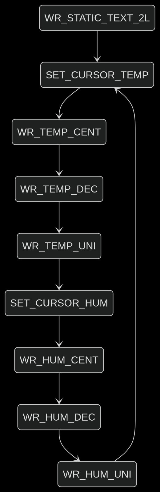
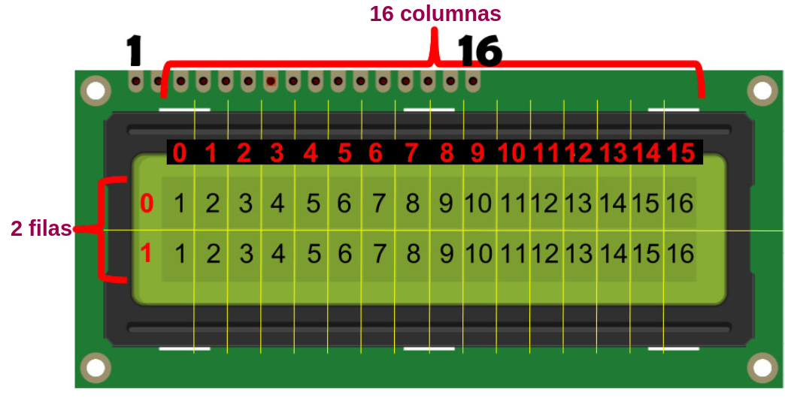
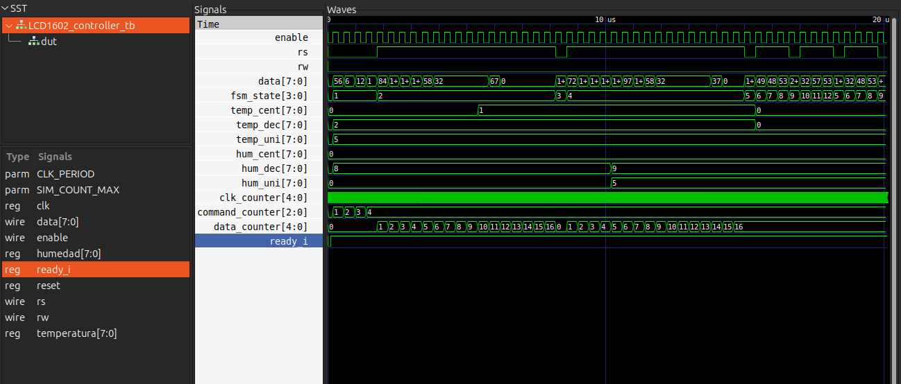

# Lab04 - Visualización usando pantalla LCD 16x2

## Integrantes

[Duván Alejandro Hernández Muñoz](https://github.com/rustam1012)

[Nixon Sebastian Escarpeta Duran](https://github.com/NixonSebastian13)

[Juan Andres Sierra Miranda](https://github.com/jusierram)

[Karen Alejandra cardenas](https://github.com/alejandraUN1208)

---

# Informe

### Índice

1. [Diseño implementado](#diseño-implementado)  
2. [Simulaciones](#simulaciones)  
3. [Implementación](#implementación)  
4. [Conclusiones](#conclusiones)  
5. [Referencias](#referencias)  

---

## Diseño implementado

### Descripción general

El **Laboratorio 4** tuvo como objetivo principal la implementación de un sistema de visualización utilizando una **pantalla LCD 16x2**. Este tipo de dispositivos permite mostrar información alfanumérica, por lo cual es ampliamente utilizado en sistemas embebidos.

El laboratorio se dividió en dos partes fundamentales:

### Primera parte

Consistía en realizar un **módulo controlador de LCD en Verilog**, que fuese capaz de inicializar la pantalla y mostrar un mensaje fijo. Se debía seguir el **protocolo de inicialización** del periférico, manejando adecuadamente los **tiempos de espera** y las señales de control (`RS`, `EN`, `RW`, etc.).  
El objetivo era lograr que el mensaje `"bateria 1"` se mostrara en la **primera línea del display** y `"bateria 2"`  en la **segunda línea del display** .

### Segunda parte

Se requería **extender el diseño del módulo anterior** para permitir la **escritura dinámica** en la pantalla, es decir, permitir que el mensaje pudiera cambiar dependiendo de entradas externas.  
Esto implicaba manejar **registros** y **controladores adicionales** que facilitaran la modificación del contenido mostrado en tiempo real. Se hacía énfasis en el uso de **registros para almacenar caracteres** a mostrar y en el control preciso del **cursor del display**.

En ambas partes, se debían cumplir los **requerimientos de temporización** especificados en la hoja de datos del LCD (por ejemplo, los **retardos mínimos entre comandos** y el **tiempo de espera después de enviar instrucciones**).

### Diagramas

Este diagrama representa la **Máquina de Estados Finitos (FSM)** desarrollada para controlar el flujo de escritura en la pantalla LCD 16x2. La FSM permite mostrar información tanto estática como dinámica (como temperatura y humedad) en posiciones específicas del display. A continuación, se explican los principales estados:

- **WR_STATIC_TEXT_2L**: Es el estado inicial, encargado de escribir los mensajes fijos en ambas líneas del display. Por ejemplo, "UNAL 2025-1" en la línea superior.
- **SET_CURSOR_TEMP**: Ubica el cursor en la posición donde debe aparecer la temperatura.
- **WR_TEMP_CENT / DEC / UNI**: Estados responsables de escribir cada uno de los dígitos (centenas, decenas, unidades) del valor de temperatura.
- **SET_CURSOR_HUM**: Ubica el cursor en la posición deseada para mostrar el valor de humedad.
- **WR_HUM_CENT / DEC / UNI**: Similar al caso de temperatura, permite mostrar los tres dígitos del valor de humedad.

Una vez que el sistema escribe todos los caracteres dinámicos, retorna al estado inicial para actualizar los valores nuevamente, generando una visualización en tiempo real.

Este diagrama muestra la disposición de caracteres dentro de una pantalla **LCD de 16 columnas y 2 filas**. La posición de cada carácter es fundamental para una correcta visualización del mensaje. Algunos aspectos clave son:

- La **fila 0** representa la línea superior del display, con columnas numeradas del 0 al 15.
- La **fila 1** representa la línea inferior, también con 16 posiciones.

## Simulaciones

Se realizaron simulaciones funcionales de los módulos encargados del control de la pantalla LCD utilizando Icarus Verilog y GTKWave. Estas permitieron verificar que las señales de control y los datos se enviaran en los tiempos correctos de acuerdo con las especificaciones del controlador HD44780.

---

## Implementación

La implementación final se realizó en la FPGA. Se conectaron los pines de la pantalla LCD a los pines de la tarjeta y se cargó el bitstream generado por la síntesis del código Verilog. En la pantalla se pudo visualizar correctamente la frase configurada en el módulo.
[implementacion en la fpga](imple.mp4)
La implementación física del controlador LCD 16x2 fue realizada sobre una **placa FPGA Cyclone IV** utilizando el lenguaje **Verilog**. En el video se puede observar la funcionalidad del sistema en tiempo real, mostrando cómo se inicializa la pantalla LCD y se visualiza información dinámica.

### Descripción del comportamiento observado

- Al iniciar el sistema, la pantalla LCD pasa por su rutina de **inicialización** (en la cual se configuran parámetros como el número de líneas, tamaño de los caracteres y modo de visualización).

- En la **línea 1 y 2**, se muestra información variable (por ejemplo, temperatura y humedad), de acuerdo con los valores que se almacenan en los registros del diseño. Esto demuestra la funcionalidad de la segunda parte del laboratorio, en la cual el mensaje mostrado puede cambiar dinámicamente.

- Los **datos enviados al LCD** son gestionados por una máquina de estados finita (FSM) que controla las señales de control (`enable`, `rs`, `rw`) y la temporización necesaria para que el periférico reciba correctamente cada instrucción o dato.

- Se utilizaron retardos adecuados (por medio de contadores internos) para respetar las especificaciones del controlador LCD y garantizar una comunicación fiable.

---

## Conclusiones

- Se logró entender el funcionamiento básico de un display LCD 16x2.
- Se aplicaron principios de diseño secuencial y temporización en hardware digital.
- Se comprobó que las simulaciones permiten depurar errores antes de implementar.

---

## Referencias

- Guía del laboratorio 4 – Sistemas Digitales I.  
- Datasheet del controlador LCD HD44780.  
- Documentación de Icarus Verilog y GTKWave.  

